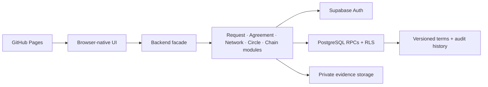

# WorkTrade

WorkTrade is a community platform for getting useful work done through cash, barter, services, goods, shared resources, or a negotiated combination. It supports ordinary two-person work agreements and closed reciprocal exchanges among several members without creating platform credits.

[Open WorkTrade](https://jay23606.github.io/worktrade/) · [Repository](https://github.com/jay23606/worktrade) · [UAT report](docs/UAT_REPORT.md)

> WorkTrade is a connected pilot build, not an unrestricted public marketplace. Payments and barter settlement happen directly between participants. WorkTrade does not hold funds, guarantee work, or verify professional competence.

## What makes it different

- **Value is negotiated, not tokenized.** People may exchange money, labor, services, materials, goods, equipment, space, access, or a combination.
- **Reputation is tied to outcomes.** Reviews, evidence, portfolios, and activity reference completed work rather than popularity.
- **Conversation requires consent.** A profile invitation states both the need and offer; private messaging opens only after acceptance.
- **Communities create trust boundaries.** Invite-only circles can keep members, resources, work, reputation, and barter chains private.
- **Multi-person barter is operational.** A chain forms one closed loop, requires unanimous versioned consent, and tracks every contribution independently.

## Product status

| Area                       | Status                | Notes                                                                                            |
| -------------------------- | --------------------- | ------------------------------------------------------------------------------------------------ |
| Accounts and profiles      | Connected             | Email-link authentication, privacy, availability, offers, needs, and resources                   |
| Public work requests       | Connected             | Drafts, photos, constraints, lifecycle history, cash/barter/hybrid proposals                     |
| Agreements                 | Connected             | Mutual confirmation, amendments, scheduling, milestones, holds, obligations, completion approval |
| Evidence and reputation    | Connected             | Private evidence, contextual reviews, verified completion stories, public portfolios             |
| Social network             | Connected             | Explainable matches, follows, saved profiles/searches, activity, notifications                   |
| Introductions              | Connected             | Consent gate, private messaging, shared planning workspace, conversion to work                   |
| Trusted circles            | Connected pilot       | Membership workflows, roles, private work, resources, rules, scoped reputation                   |
| Multi-person barter chains | Connected pilot       | Circle-only discovery, unanimous consent, execution modes, holds, approvals, disputes            |
| Moderation operations      | Pilot ready           | Private reports, staff queue, restrictions, appeals, immutable actions, initial admin, and an operating runbook |
| Transactional email        | Safe staging          | Private outbox, preferences, retries, delivery logs, and sink dispatcher; production provider/domain remain disabled |
| Transactional email        | Incomplete            | Preferences persist; production delivery is not active                                           |
| Payments or escrow         | Not planned for pilot | Participants settle directly                                                                     |

## Primary journeys

### Request → agreement → verified outcome

1. A member publishes work with the desired outcome, constraints, skills, location privacy, and acceptable exchange modes.
2. Another member proposes scope, exclusions, responsibilities, milestones, timing, and value exchanged.
3. The requester selects a proposal; both people independently confirm the same terms.
4. Participants message, schedule, resolve dependencies, complete milestones, and approve each side of the exchange.
5. Completion requires counterparty approval. Evidence, contextual reviews, and an optional portfolio story remain tied to the agreement.

### Profile → introduction → work

1. Explainable matching shows how one member's offers and needs overlap another's.
2. A collaboration invitation states both sides of a possible exchange.
3. The recipient accepts, declines, or mutes it. Messaging opens only after acceptance.
4. Both people negotiate scope, responsibilities, materials, exclusions, exchange, and availability in a versioned workspace.
5. Both confirm the same version before it becomes a private work draft.

### Circle → reciprocal barter chain

1. Active members of the same trusted circle discover or manually build a closed loop of at least three contributions.
2. Every participant reviews the entire loop and accepts the same version. Any revision resets all consent.
3. The chain runs simultaneously, sequentially, or conditionally. Dependencies can pause the whole chain or one link.
4. Providers submit fulfillment and recipients approve it. The chain completes only when every link is approved.
5. Unfulfilled chains may be renegotiated; active chains may be cancelled or disputed without rewriting history.

## Trust and privacy boundaries

- PostgreSQL security-definer workflows authorize consequential mutations and lock current versions.
- Row-level security limits private requests, messages, evidence, circle data, and chains to eligible participants.
- Accepted request terms and chain versions cannot be silently rewritten.
- Agreement and chain revisions reset prior confirmations.
- A contributor cannot approve their own obligation.
- Private introduction messaging requires acceptance and honors blocks, cooldowns, and invitation rate limits.
- Circle member directories, resources, work, and chains require active membership.
- Evidence uses private object storage and short-lived signed URLs.
- Account deactivation removes public presence while preserving pseudonymous counterpart history.
- The public Pages artifact contains browser runtime files only; migrations, tests, and repository internals are not deployed.

## Architecture



The client is plain HTML, CSS, and ES modules. `modules/backend.js` is a stable compatibility facade; implementations live in domain modules under `modules/backend/`. High-risk transitions are database functions or the agreement Edge Function rather than client-side table writes.

## Repository map

```text
app.js                         UI composition and interaction handlers
modules/backend.js             stable backend export facade
modules/backend/               account, request, agreement, network, circle, chain, trust domains
modules/agreements.js          pure agreement and chain invariants
modules/store.js               reactive client state
supabase/migrations/           append-only hosted schema and authorization changes
supabase/functions/            server-authoritative agreement action function
tests/                         unit and UAT contract tests
scripts/integration-test.mjs   destructive temporary-user hosted lifecycle test
docs/UAT_REPORT.md             findings, release gates, and manual pilot checklist
docs/MODERATION_RUNBOOK.md     staff triage, action, appeal, and escalation procedure
```

## Run locally

Requirements: a recent Node.js release and Python available as `python`.

```bash
npm test
npm run test:uat
npm start
```

Open `http://localhost:8080`.

The committed `config.js` contains browser-safe public Supabase configuration only. For another deployment, copy `config.example.js` to `config.js` and provide that project's URL and publishable key. Never commit service-role keys, email-provider credentials, payment credentials, or identity-verification secrets.

## Supabase deployment

Link the CLI to the intended project, review the target, then apply migrations in order:

```bash
supabase link --project-ref YOUR_PROJECT_REF
supabase db push
supabase functions deploy wt-agreement-action
```

Do not edit an applied migration. Add a later migration that replaces the affected policy or function.

## Testing

```bash
npm test             # syntax, domain invariants, store tests, UAT contracts
npm run test:uat     # deployment and authorization contract checks only
npm run test:integration         # two-user request-to-completion lifecycle
npm run test:integration:chains  # private circle and three-party chain
npm run test:integration:moderation # report, restriction, appeal, audit
npm run test:integration:email      # private outbox and sink dispatcher
```

The hosted integration tests create temporary users, exercise the real request-to-completion and reciprocal-chain workflows, validate authorization failures, and remove their test identities and evidence in `finally`. Both run through the protected `hosted-uat` GitHub Actions environment when backend or integration-test code changes. Local runs require:

- `WT_SUPABASE_URL`
- `WT_SUPABASE_PUBLISHABLE_KEY`
- `WT_SUPABASE_SECRET_KEY`

Do not place the secret key in GitHub Pages configuration or public CI logs. See [docs/UAT_REPORT.md](docs/UAT_REPORT.md) for automated coverage and the remaining manual checks.

## Deployment

Pushing `main` runs the Pages workflow. It builds an explicit allowlisted artifact containing only the browser application and then deploys it. Database migrations and Edge Functions are deployed separately through Supabase. A protected scheduled workflow invokes the email dispatcher every five minutes; it remains in `sink` mode until production email is explicitly configured.

## Release gates

Before opening registration beyond a supervised 5–15 person pilot:

- Review moderation staffing and response coverage before expanding beyond the supervised pilot.
- Authorize a sending domain and explicitly change transactional email from `sink` to a configured production provider.
- Establish prohibited-work, safety, privacy, terms, retention, and permanent-erasure policies.
- Keep both protected hosted UAT lifecycles passing, including nonparticipant REST authorization attempts.
- Resolve all P1 findings in [the UAT report](docs/UAT_REPORT.md).

Integrated payment collection, custody, exchange credits, and escrow are intentionally outside the pilot.
